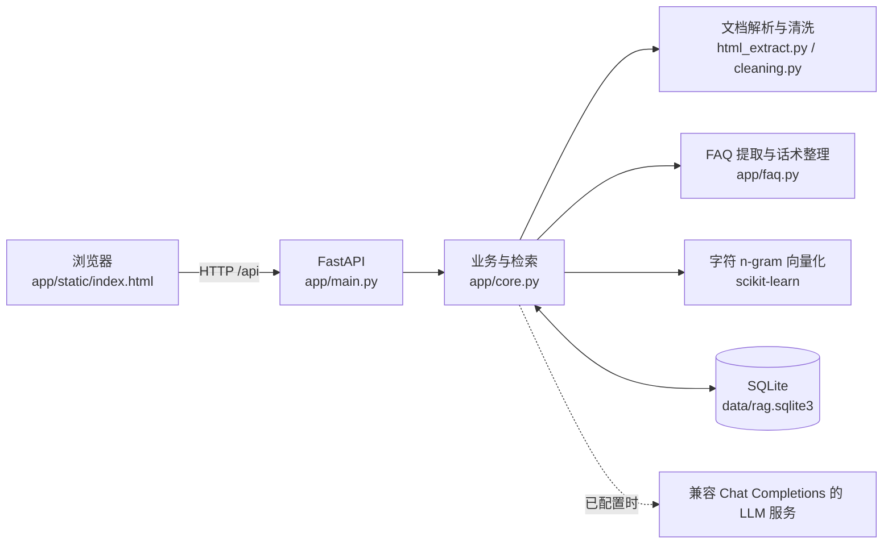
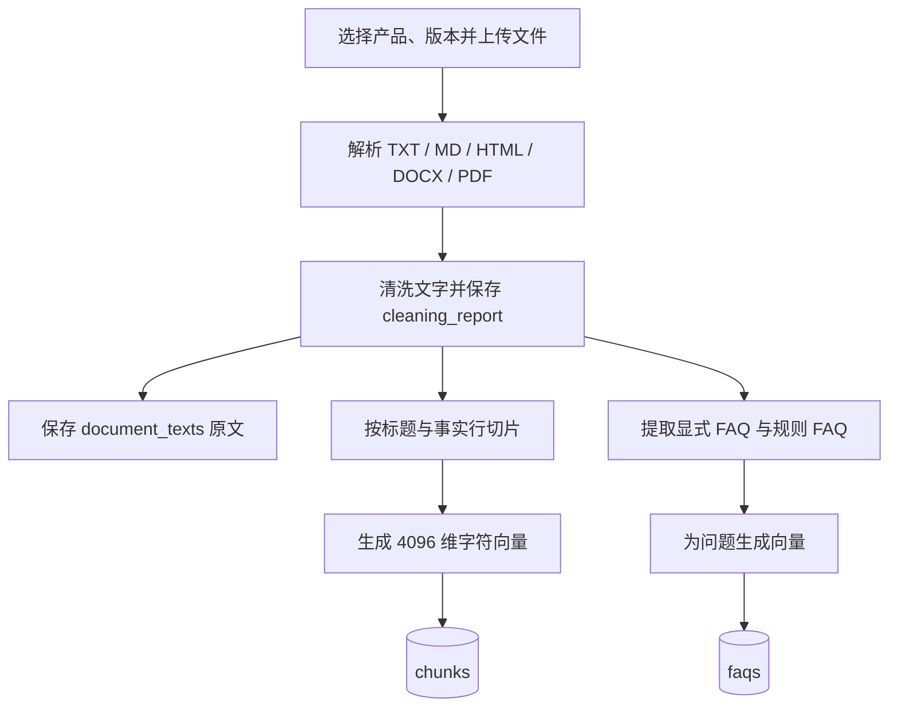
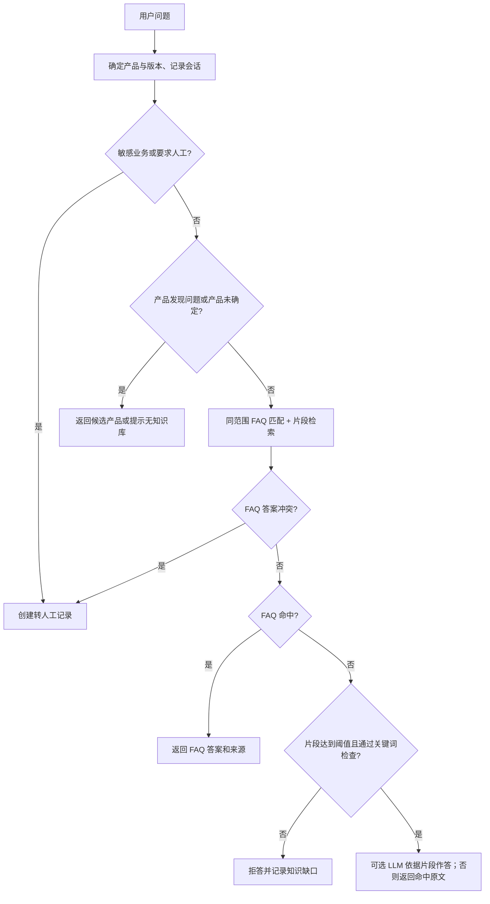

# 产品知识问答项目架构

本文描述仓库当前实现，适用于开发、演示和后续改造。项目是本地运行的产品知识问答应用：将产品资料整理为可检索片段和问答，按产品与版本回答用户问题，并记录知识缺口、人工补充和评价。

## 1. 总体结构

这是单体应用，没有独立的向量数据库或训练服务。页面是原生 HTML、CSS 和 JavaScript；后端由 Uvicorn 承载 FastAPI；SQLite 同时保存业务记录、清洗后的原文和向量。默认数据库路径是 `data/rag.sqlite3`，可用 `RAG_DB` 环境变量覆盖。

## 2. 模块职责

| 位置 | 职责 |
| --- | --- |
| `app/static/index.html` | 产品与版本选择、聊天、资料导入、话术整理、知识缺口和统计界面；通过 `fetch` 调用 API。 |
| `app/main.py` | FastAPI 路由、请求字段校验、异常到 HTTP 状态码的转换、统计查询。 |
| `app/core.py` | 数据库初始化、资料入库、向量检索、FAQ 匹配、会话编排、转人工、人工补充和可选 LLM 调用。 |
| `app/html_extract.py` | 从 HTML 提取可见文字，保留标题和块级分隔，过滤脚本、样式等页面内容。 |
| `app/cleaning.py` | 规范化字符和空白、过滤页码与重复行，并生成清洗报告。 |
| `app/faq.py` | 提取原文中的显式问答；从明确事实、章节和带主题的条目生成来源可核对的问答。 |
| `prompts/answer.txt` | 可选 LLM 在片段回答路径使用的系统提示词。 |
| `seed.py`、`data/demo_knowledge.json` | 导入虚构演示产品和资料。 |
| `evaluate.py`、`data/eval_cases.json`、`tests/` | 可复现评估样例及自动化测试。 |
| `run_server.py`、`start_mac.command`、`start_windows.bat` | 本地启动入口。 |

## 3. 资料导入流程

上传接口是 `POST /api/documents`，单文件上限 5 MB。支持 `.txt`、`.md`、`.html`、`.htm`、`.docx` 和可提取文字的 `.pdf`。HTML 提取可见正文；DOCX 读取文档 XML；PDF 使用 `pypdf` 提取文字，扫描件需要事先 OCR。

清洗后的完整文字保存在 `document_texts`。切片默认每段最多约 360 字，长行重叠 50 字，标题随正文一起存入片段。`HashingVectorizer` 使用字符 2 至 4 gram、4096 维、L2 归一化；向量以 `float32` 字节存入 SQLite。导入时还会识别文档中的 `Q:/A:`、`问题:/答案:`，并从明确事实或章节标题生成初始 FAQ。

## 4. 话术整理与人工补充

“整理产品话术”调用 `POST /api/faqs/train`，可以限定产品和版本。它逐份读取已保存的资料原文，从章节、显式问答以及“首次开机：…”“无法充电：…”这类带主题的条目补充问答。保存前会检查答案文字出自该文档，并按文档及规范化问题去重，因此重复执行不会重复新增。旧文档缺少完整原文时，系统会尽量从已存片段重建。

这里的“训练”是**整理并索引 FAQ**，不会修改模型参数。自动生成的答案基于资料文字，仍可能需要人工审核问法是否自然、适用范围是否准确。

人工补充走 `POST /api/faqs/manual`，或对知识缺口调用 `POST /api/gaps/{gap_id}/answer`。人工答案作为独立资料、片段和 FAQ 入库；填写知识缺口时会校验产品、版本和问题范围。若同一范围已有不同答案，接口会要求先核对资料。

## 5. 问答决策流程

`POST /api/ask` 是主入口。产品范围可来自页面选择、问题中的产品名称或会话上下文；版本随产品范围确定。含简单追问词的问题会拼接上一轮用户问题。FAQ 匹配会参考意图类别、关键英文词、字符向量相似度和二元字符覆盖率；片段检索按同一产品、同一版本过滤，返回最多 4 条候选，使用向量相似度与字符重合度排序。低于当前演示阈值 `0.16` 或未通过英文关键词检查时拒答。

命中 FAQ 时将保存的答案作为事实答案返回。未命中 FAQ 但片段足够相关时，若设置了 `LLM_BASE_URL`、`LLM_API_KEY` 和 `LLM_MODEL`，后端会把命中片段交给兼容 Chat Completions 的服务；未设置或调用失败时返回命中片段原文。API 的 `answer` 保留事实答案，聊天界面展示的 `display_answer` 仅增加口语化引导，不改变事实内容；`suggested_questions` 从同产品、同版本的 FAQ 中选择最多两个后续问题。回答还附带来源、相关度、状态、会话 ID 和消息 ID。退款、投诉等关键词触发转人工；资料不足的问题进入 `unanswered`，供人工补充。

## 6. 数据模型

| 表 | 主要内容 | 关系或用途 |
| --- | --- | --- |
| `products` | 产品 ID、名称、别名 | 产品范围的根节点。 |
| `documents` | 产品、版本、类别、标题、来源、清洗报告 | 一份导入资料或人工 FAQ。 |
| `document_texts` | 清洗后的完整文字 | 与 `documents` 一对一，供再次整理 FAQ。 |
| `chunks` | 文本片段及向量 | 按产品和版本检索；删除文档时级联删除。 |
| `faqs` | 问题、答案、类别、来源、生成类型及问题向量 | 优先回答的结构化问答；删除文档时级联删除。 |
| `sessions` | 当前会话的产品、版本和创建时间 | 保存会话范围。 |
| `messages` | 用户与助手消息、回答状态、产品 ID | 会话历史与咨询统计。 |
| `unanswered` | 无答案问题、产品、版本、解决时间 | 知识缺口列表。 |
| `handoffs` | 转人工摘要和状态 | 敏感业务或冲突答案的记录。 |
| `feedback` | 对具体助手消息的正负评价 | 同一消息只保留一条当前评价。 |

`chunks` 和 `faqs` 都有 `(product_id, version)` 索引。问答类型主要有文档显式问答、规则或章节问答、按需整理问答以及人工问答。数据库初始化时会为旧库补充新增字段。

## 7. 主要 API

| 接口 | 作用 |
| --- | --- |
| `GET /api/products`、`GET /api/products/featured`、`GET /api/products/catalog`、`GET /api/products/search` | 产品选择、热门产品和搜索。 |
| `POST /api/products` | 新建或更新产品。 |
| `POST /api/documents`、`GET /api/documents`、`DELETE /api/documents/{id}` | 导入、查看和删除资料。 |
| `GET /api/faqs`、`POST /api/faqs/train`、`POST /api/faqs/manual` | 查看、整理和人工补充问答。 |
| `POST /api/ask` | 提问并返回答案、状态与来源。 |
| `POST /api/gaps/{id}/answer` | 为知识缺口补充答案。 |
| `POST /api/feedback` | 对指定回答提交“有帮助 / 没帮助”评价。 |
| `GET /api/stats`、`GET /api/handoffs` | 查看统计、知识缺口和转人工记录。 |

FastAPI 自动接口文档位于 `/docs`。

## 8. 运行与边界

本地运行可使用启动脚本，或安装 `requirements.txt` 后执行 `uvicorn app.main:app --reload`。`run_server.py` 会在 `127.0.0.1` 的 8000 至 8010 端口中选择可用端口。示例资料由 `seed.py` 导入。

当前实现面向课堂演示：没有管理员鉴权、权限隔离、限流或正式工单系统；SQLite 和内存中逐条比较向量适合小规模资料；字符 n-gram 并非语义 Embedding。可选 LLM 只用于片段回答，现有代码没有逐句忠实度校验。上线前需要补充权限和审核、检索质量评估、文档 OCR、冲突治理及运行监控。
