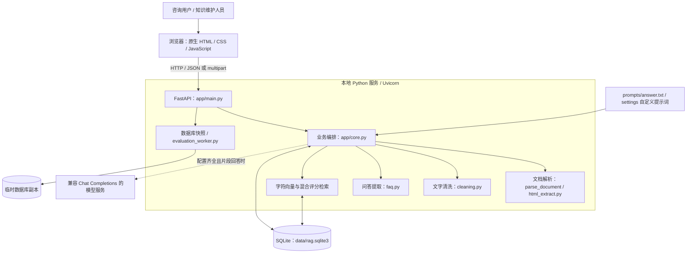
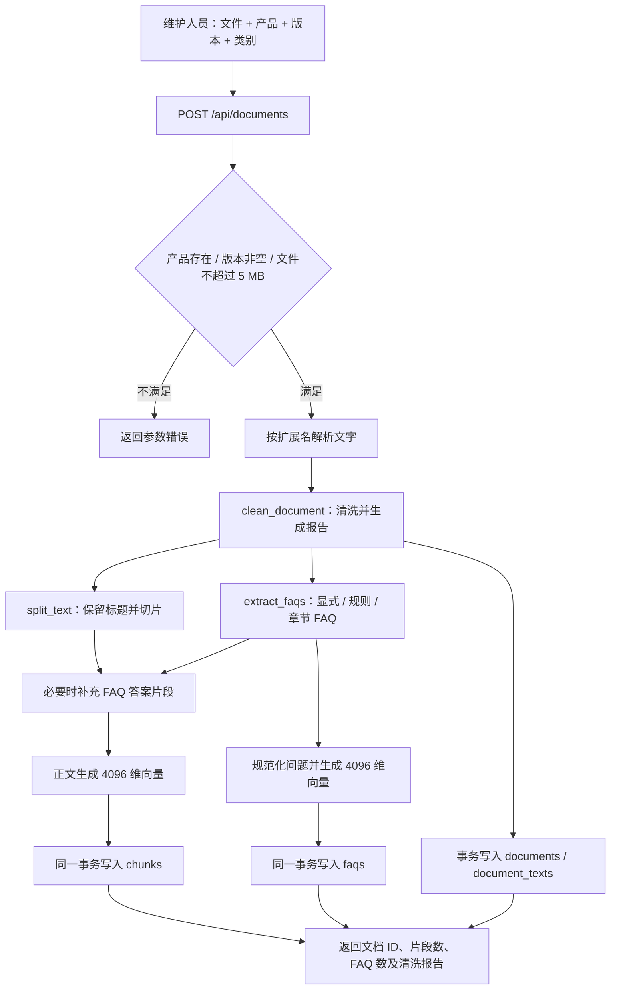
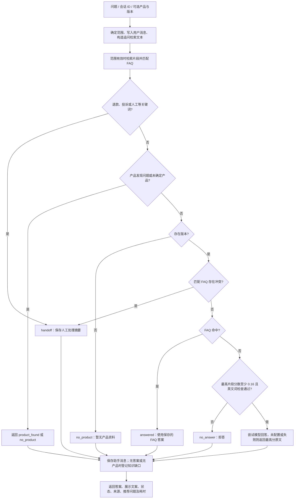
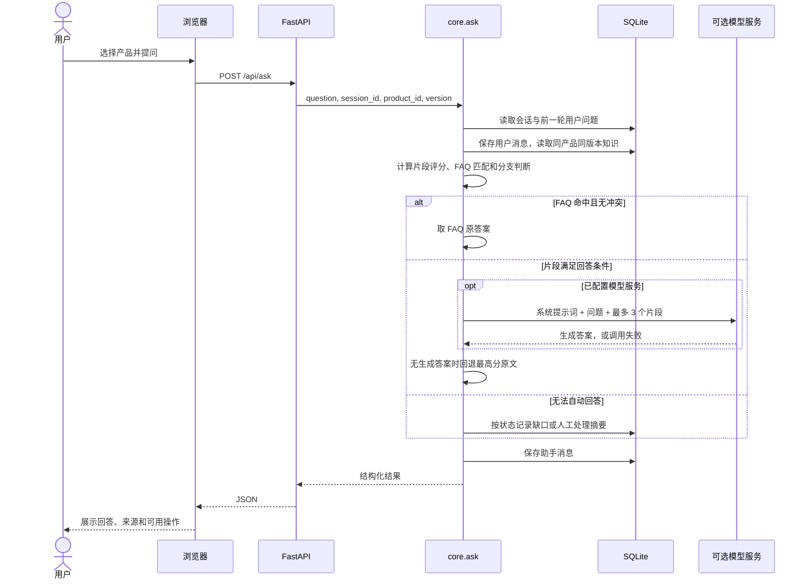
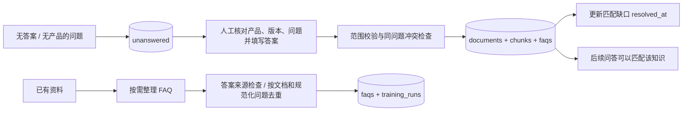
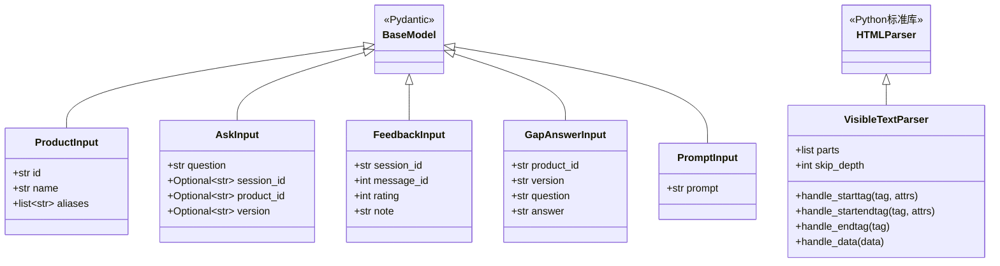
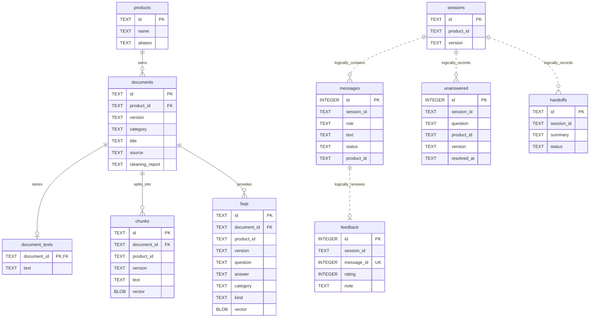

# 产品知识库问答系统：架构、数据流程与核心实现设计文档

整理日期：2026-10-02。本文以当前仓库源代码为依据，面向课程报告、项目答辩与维护交接。图表采用 Mermaid，可在支持 Mermaid 的 Markdown 阅读器中查看。

## 1. 项目概述

系统用于将产品说明书、操作指南和常见问题整理为可检索知识，按照产品和版本回答用户问题，并形成“资料导入—问答服务—知识缺口—人工补充—再次问答”的闭环。

主要使用场景包括：查询产品功能与参数、查询操作步骤、识别产品知识库、处理连续追问、记录无法回答的问题，以及将退款、投诉或资料冲突转为人工处理记录。

系统采用本地单体架构：原生网页负责交互，FastAPI 提供接口，SQLite 保存业务数据和向量，字符 n-gram 哈希向量完成检索。回答优先使用结构化 FAQ；没有匹配 FAQ 时，使用检索片段，按配置选择调用大模型或直接返回原文。

**实现范围说明：**当前没有独立向量数据库、语义 Embedding 模型或模型微调流程。“整理产品话术／训练”指从资料中提取并索引 FAQ；转人工指保存本地记录，没有接入外部客服工单系统。

## 2. 系统架构设计

### 2.1 总体架构图



### 2.2 模块职责与技术选型

| 层次 / 模块 | 代码位置 | 职责与选型原因 |
| --- | --- | --- |
| 展示层 | `app/static/index.html` | 聊天、产品选择、上传、FAQ 整理、缺口补充、反馈、统计及评估；无需前端构建服务。 |
| 接口层 | `app/main.py` | Pydantic 请求模型、API 路由、参数校验与 HTTP 错误转换。 |
| 业务层 | `app/core.py` | 产品和版本范围、会话、入库、检索、FAQ 匹配、拒答、人工记录和可选模型调用。 |
| 解析层 | `app/html_extract.py`、`core.parse_document` | HTML 可见文字、TXT/MD、DOCX XML、PDF 文字提取。 |
| 清洗层 | `app/cleaning.py` | 字符规范化、空白和页码处理、相邻重复行过滤、生成清洗报告。 |
| FAQ 生成 | `app/faq.py` | 提取显式问答，根据明确事实、章节及主题条目构造问法，答案来自资料。 |
| 检索计算 | NumPy、scikit-learn | 无需拟合的哈希向量，点积与字符覆盖率混合评分。 |
| 持久化 | SQLite | 单文件部署，保存关系数据与 `float32` 向量 BLOB。 |
| 评估 | `evaluate.py`、`app/evaluation_worker.py` | 固定样例回归、状态混淆矩阵、来源命中率。 |
| 启动 | `run_server.py`、平台启动脚本 | 本地环境准备与启动；服务选择 8000～8010 范围内可用端口。 |

关键设计取舍：单体与 SQLite 降低演示部署成本；产品和版本先过滤，减少串答；FAQ 优先提供稳定答案；保留来源和清洗报告支持核对；可选模型失败后回退原文，使离线环境也能完成问答。

## 3. 数据流程设计

### 3.1 资料导入数据流程图



输入支持 `.txt`、`.md`、`.html`、`.htm`、`.docx` 和可提取文字的 `.pdf`。TXT/MD 使用 UTF-8 BOM 兼容解码；HTML 处理编码与可见文字；DOCX 从压缩包的 `word/document.xml` 提取段落；PDF 使用 `pypdf`。扫描版 PDF 需要在系统外完成 OCR。

入库保存的是清洗后的完整文字和派生知识，并未将上传文件原始字节作为附件保存。`documents.source` 通常为文件名，不是可直接打开的文件下载地址。

### 3.2 在线问答决策流程图



图中保留实际执行顺序：代码先计算检索结果，再按优先级判断人工、产品发现、FAQ 与片段分支。因此“人工分支优先”是回答决策优先级，并不表示一定跳过前面的检索计算。

### 3.3 问答交互时序图



### 3.4 知识维护闭环



人工补充同一问题的不同答案会被拒绝，要求先核对已有资料；相同答案可以复用已有 FAQ。解决缺口时，更新的是同问题、同产品、同版本的未解决记录。用户评价写入 `feedback`，目前不会自动修改检索权重或训练模型。

## 4. 类图与数据模型

### 4.1 当前代码实际类图

项目以函数式模块组织业务，没有 `RAGService`、`DocumentRepository` 等业务类，也未使用 ORM。以下仅画出实际定义的类；数据库实体另用 ER 图表示。



请求模型在 `app/main.py` 定义；`VisibleTextParser` 在 `app/html_extract.py` 定义。前者承接接口数据，后者通过 HTML 解析回调收集正文、保留标题与块级换行，并跳过脚本、样式和导航等内容。

### 4.2 数据库实体关系图



图中省略部分时间、类别和来源字段。实线关系对应代码中声明的外键；虚线表示应用逻辑关联，不代表数据库已建立对应外键。`document_texts` 为可选的一对一：普通导入会保存全文，人工补充和旧数据可能没有全文记录。

另有两张配置／统计表：

| 表 | 字段与用途 |
| --- | --- |
| `settings` | `key` 主键、`value`；保存自定义 `answer_prompt`。 |
| `training_runs` | `id`、`created_at`、`product_id`、`version`、`documents_scanned`、`faqs_added`、`total_faqs`；记录每次 FAQ 整理情况。 |

数据库约束和一致性策略：

- `connect()` 开启 `PRAGMA foreign_keys=ON`；删除文档会级联删除其全文、片段和 FAQ。
- `chunks`、`faqs` 在 `(product_id, version)` 上建立索引，用于范围过滤；向量相似度仍在 Python 中计算。
- `feedback.message_id` 建立唯一索引，一条回答保留一条当前评价，再次评价更新原记录。
- 普通导入在同一数据库事务内写入关联知识；人工补充和关闭缺口也在同一事务中执行。
- FAQ 整理逐文档使用 `BEGIN IMMEDIATE`，重新检查文档存在性与问题去重后写入，每份文档完成后提交。
- `init_db()` 通过检查字段并执行 `ALTER TABLE` 兼容部分旧库结构，并非独立的版本化迁移框架。

## 5. 核心算法设计

### 5.1 文本清洗与上下文切片

`clean_document()` 使用 NFC 规范化并转换全角 ASCII，统一换行与空白，移除零宽字符和非必要控制字符；只删除匹配规则的页码、空行，以及长度至少 6 字的相邻重复行。清洗不推断或改写产品事实，各类处理数量写入报告。

`split_text(text, max_chars=360, overlap=50)` 按行处理：

1. `#` 标题更新当前上下文，标题最多保留 80 字，并附加到后续片段。
2. 问题标记或问号结尾的行不直接作为事实片段；答案标记从正文中去除。
3. 小于 6 字的短行先合并到后续事实行。
4. 长行按正文可用长度切片，相邻窗口默认重叠 50 字。

设标题前缀长度为 `p`，正文容量为 `r = max(80, 360 - p)`，步长为 `max(1, r - 50)`。这种方式保留章节上下文，同时避免完全不重叠切分造成边界信息丢失。它不是递归语义切分；问号结尾的真实事实也可能被过滤。

### 5.2 字符 n-gram 哈希向量

向量化参数：`analyzer='char'`、`ngram_range=(2,4)`、`n_features=4096`、`alternate_sign=False`、`norm='l2'`、`lowercase=True`。

文本被分解为连续 2～4 字符的片段，通过哈希映射到固定维度并累计，再执行 L2 归一化。对于非零向量 `x`：

```text
v(x) = h(x) / ||h(x)||₂
cosine(q, d) = v(q) · v(d)
```

零向量的点积为零。索引以 `float32` 保存，每条向量占 `4096 × 4 = 16384` 字节，约 16 KiB，不含文本及 SQLite 开销。10,000 条片段向量约占 156.25 MiB，FAQ 向量需另计。

这种方法无需维护词表或训练，适合离线演示与中文局部字词匹配；它不等同于语义模型，存在哈希碰撞、同义改写召回不足和否定表达混淆等限制。代码中的局部变量 `semantic` 实际也是字符哈希向量点积。

### 5.3 同产品、同版本的片段混合检索

`retrieve()` 首先执行精确 SQL 过滤，再移除问题中的产品名、部分口语词、数字和标点。文档索引主要使用片段正文，标题仍保留在返回文本中。

设 `G₂(q)` 为清理后问题的二元字符集合，`G₂(d)` 为片段正文二元字符集合：

```text
coverage(q, d) = |G₂(q) ∩ G₂(d)| / max(1, |G₂(q)|)
score(q, d) = 0.7 × cosine(q, d) + 0.3 × coverage(q, d)
```

覆盖率的分母为问题集合大小，强调问题关键词是否被资料覆盖，因此并非 Jaccard 相似度。结果保留四位小数后排序，默认返回 Top-4，最终响应最多附带 3 条来源。

候选数为 `N`、维数为 `D=4096` 时，逐条向量比较约为 `O(ND)`，排序约为 `O(N log N)`；还需扫描文本计算字符集合。当前读取全部范围内候选，没有近似最近邻索引。

### 5.4 FAQ 提取、匹配与冲突识别

FAQ 分为五类：`explicit`（显式问答）、`rule`（事实规则）、`auto`（章节归纳问法）、`trained`（按需整理主题问法）和 `manual`（人工补充）。这些类型表示生成方式，不表示模型训练轮次。

`match_faq()` 的步骤如下：

1. 使用 `faq_terms()` 去除产品名、部分数字、口语词和标点，生成问题检索文本。
2. 使用 `faq_intent()` 识别价格、保修、兼容、场景、参数、故障、步骤、功能等规则意图；有明确意图时过滤类别，但允许“文档 FAQ”和“人工 FAQ”。
3. 提取长度至少 2 的英文词，排除产品自身英文词后，要求其出现在候选问题或答案中。
4. 对候选问题计算与片段检索同形式的混合评分；必须同时满足 `score >= 0.38` 和 `coverage >= 0.25`。
5. 选取最高分候选；在已通过筛选的候选中，检查与它规范化问题相同的答案是否不同。存在不同答案则返回冲突标记，主流程转人工。

冲突识别的范围是“通过筛选且规范化问题相同”的 FAQ，不是对全部文档做语义矛盾检测。FAQ 命中直接返回保存的答案，不调用大模型。

### 5.5 FAQ 按需整理与幂等性

`bootstrap_faqs()` 优先读取 `document_texts`；旧文档没有全文时，通过 `reconstruct_chunk_text()` 合并片段并尝试消除重叠。随后组合基础 FAQ 和主题条目 FAQ 候选。

候选答案每一行必须能在来源文档中找到，才允许写入；以“当前文档 + `faq_terms(question)`”去重；每 64 条候选批量生成向量。重复整理相同资料不会重复新增同键问题。历史记录保存扫描数、新增数、总数，可用于显示知识整理曲线，但不能作为模型准确率提升的证据。

### 5.6 产品发现与多轮上下文

产品发现针对已导入资料的产品：名称、ID 或满足条件的别名直接命中时分数为 1；否则对该产品片段计算混合分数，最高分达到 `0.28` 才返回候选，默认最多 6 个。分数相同时参考咨询量及名称排序。

普通问答的产品确定顺序是：问题文本中的产品名称／ID／别名命中，随后才使用显式选择或历史产品。若文本命中多个产品，当前实现按数据库读取顺序遇到的首个匹配确定，并没有多产品比较推理。

版本优先使用当前请求，其次使用同产品历史版本；仍缺失时选择最近导入资料的版本，排序依据为 `created_at DESC, rowid DESC`，不是语义版本号大小。

若问题包含“它、这个、多少、怎么、呢”等追问词，系统构造：

```text
上一轮用户问题 + "；追问：" + 当前问题
```

这是启发式字符串拼接，不是模型生成的指代消解；仅使用上一轮用户文本，跨产品追问时可能带入旧问题词语。

### 5.7 拒答、转人工与模型回退

| 条件 | 行为 |
| --- | --- |
| 当前问题包含退款、投诉、退货、人工、账户权限等配置词 | `handoff`，保存包含近期最多 6 条消息的摘要。 |
| FAQ 候选存在同问题答案冲突 | `handoff`，提示人工核对。 |
| 片段最高分低于 `0.16` | `no_answer`，不返回来源，登记缺口。 |
| 当前问题中的关键英文词未出现在最高分片段 | `no_answer`；片段路径检查长度至少 3 的英文词，并有固定演示产品词排除项。 |
| 产品或资料版本无法确定 | 按分支返回产品候选或 `no_product`；后者登记缺口。 |
| 片段足够相关、模型未配置／异常／结果为空 | 返回最高分片段原文。 |

模型调用需同时具备 `LLM_BASE_URL`、`LLM_API_KEY`、`LLM_MODEL`。请求使用 `temperature=0`，传递最多 3 条片段，超时 20 秒。Prompt 来自数据库覆盖配置或 `prompts/answer.txt`，要求依据资料回答并注明编号。

`confidence` 是检索相关度，不是校准后的正确概率；非回答分支也可能保留前面算出的片段分数。当前未对模型生成答案做逐句证据校验，也未将模型文本中的拒答自动转换为 `no_answer` 状态。

## 6. 关键代码与说明

以下节选来自当前实现，省略无关上下文；完整逻辑以链接中的源文件和函数为准。

### 6.1 向量配置与入库

位置：[app/core.py](app/core.py)，`VECTORIZER`、`add_document()`。

```python
VECTORIZER = HashingVectorizer(analyzer='char', ngram_range=(2, 4), n_features=4096,
                               alternate_sign=False, norm='l2', lowercase=True)

vectors = VECTORIZER.transform(
    [c.split('\n', 1)[-1] for c in chunks]
).astype(np.float32).toarray()
```

索引排除存储片段的标题前缀，避免产品名与通用标题主导检索；`float32` 保证序列化与读取类型一致。向量通过 `v.tobytes()` 写入 BLOB，通过 `np.frombuffer(..., dtype=np.float32)` 恢复。

### 6.2 范围过滤与混合评分

位置：[app/core.py](app/core.py)，`retrieve()`。

```python
rows = db.execute('SELECT * FROM chunks WHERE product_id=? AND version=?',
                  (product_id, version)).fetchall()

vec = np.frombuffer(row['vector'], dtype=np.float32)
semantic = float(np.dot(query_vec, vec))
a = set(clean[i:i+2] for i in range(len(clean)-1))
body = row['text'].split('\n', 1)[-1]
b = set(body[i:i+2] for i in range(len(body)-1))
overlap = len(a & b) / max(1, len(a))
score = 0.7 * semantic + 0.3 * overlap
```

先隔离产品版本，再计算相似度；SQL 使用参数绑定。字符覆盖率补充短中文参数问题的排序能力，相关度阈值则由问答主流程决定。

### 6.3 FAQ 门槛与冲突判定

位置：[app/core.py](app/core.py)，`match_faq()`。

```python
if score >= 0.38 and coverage >= 0.25:
    candidates.append((score, row))

candidates.sort(key=lambda pair: pair[0], reverse=True)
score, row = candidates[0]
same_question = [item for _, item in candidates
                 if faq_terms(item['question'], product['name'])
                 == faq_terms(row['question'], product['name'])]
conflict = len({item['answer'].strip() for item in same_question}) > 1
```

双门槛避免仅靠向量碰撞产生匹配；同键答案集合大于 1 时交由人工处理，而不是任取一个冲突答案。

### 6.4 FAQ 整理的来源检查

位置：[app/core.py](app/core.py)，`bootstrap_faqs()`。

```python
answer_lines = [line.strip() for line in faq['answer'].splitlines() if line.strip()]
if not key or not answer_lines or any(
        line not in source_lines and line not in source_text for line in answer_lines):
    source_rejected += 1
    continue
```

通过原文行或子串存在性检查约束新增答案来源。它保证文字可追溯，但不保证生成的问题与答案在语义上一定匹配，仍需人工抽查。

### 6.5 可选模型与离线回退

位置：[app/core.py](app/core.py)，`ask()`、`llm_answer()`。

```python
try:
    generated = llm_answer(rewritten, sources[:3])
except Exception:
    generated = None
answer = generated or sources[0]['text']
```

外部模型失败不阻断整个回答；已有片段作为回退答案。当前捕获所有异常并静默回退，便于演示，但后续需要增加异常日志来定位服务问题。

### 6.6 反馈唯一性与评估隔离

位置：[app/main.py](app/main.py)，`feedback()`、`evaluation()`。

反馈先校验目标消息属于指定会话、角色为助手且状态为 `answered`，然后使用 `ON CONFLICT(message_id) DO UPDATE` 更新当前评价。

网页评估通过 SQLite `backup()` 生成临时副本，以子进程的 `RAG_DB` 指向副本，并移除模型配置后运行 `app.evaluation_worker`。问答过程中产生的消息与知识缺口只写入副本，正式咨询记录不受影响；子进程限制为 45 秒。

## 7. 接口与响应设计

### 7.1 接口清单

| 方法与路径 | 用途 / 主要参数 |
| --- | --- |
| `GET /api/products` | 产品及版本列表。 |
| `POST /api/products` | 新建或更新产品；`id`、`name`、`aliases`。 |
| `GET /api/products/featured` | 热门产品；无咨询数据时返回全部已索引产品。 |
| `GET /api/products/catalog` | 已导入知识的产品目录与统计。 |
| `GET /api/products/search?q=...` | 产品发现。 |
| `POST /api/documents` | multipart 文件上传及产品、版本、类别、标题。 |
| `GET /api/documents` | 资料列表，可按产品过滤。 |
| `DELETE /api/documents/{document_id}` | 删除资料及关联知识。 |
| `GET /api/faqs` | 按产品、版本返回 FAQ。 |
| `POST /api/faqs/train` | 按需整理，可用查询参数限定产品、版本。 |
| `POST /api/faqs/manual` | 人工问答入库。 |
| `POST /api/ask` | 主问答接口。 |
| `POST /api/gaps/{gap_id}/answer` | 人工补充并解决知识缺口。 |
| `POST /api/feedback` | 指定回答的正负评价，`rating` 为 `1` 或 `-1`。 |
| `GET /api/prompt` | 读取当前、默认 Prompt 和模型配置状态。 |
| `PUT /api/prompt` | 保存自定义 Prompt，长度 10～10000 字。 |
| `DELETE /api/prompt` | 恢复默认 Prompt。 |
| `GET /api/stats` | 咨询状态、解决率、反馈、未解决缺口统计。 |
| `GET /api/handoffs` | 最近最多 50 条人工处理记录。 |
| `GET /api/evaluation` | 数据库副本上的固定样例评估与 FAQ 整理历史。 |

API 自动文档入口为 `/docs`。常见业务输入错误返回 HTTP 400；缺口、回答或删除目标不存在等情况返回 HTTP 404；请求模型结构校验由 FastAPI/Pydantic 处理。

### 7.2 主问答协议

请求示例，使用仓库虚构演示产品：

```json
{
  "question": "星云笔记最多支持多少个标签？",
  "product_id": "nova_notes",
  "version": "2.0"
}
```

连续追问时传回服务返回的 `session_id`。问题业务长度限制为 1～1000 字。

| 返回字段 | 含义 |
| --- | --- |
| `session_id`、`message_id` | 会话与本次助手消息标识，后者用于评价。 |
| `product_id`、`version` | 实际确定的产品版本范围。 |
| `rewritten_question` | 拼接上下文后的检索问题。 |
| `answer` | 保存的答案正文。 |
| `display_answer` | 用于聊天显示的文案，可能增加引导语或去除展示用标题。 |
| `status` | `answered`、`no_answer`、`handoff`、`product_found`、`no_product`。 |
| `confidence` | FAQ 或片段的相关度分数。 |
| `sources` | 最多 3 个来源对象，包含 `chunk_id`、`source`、`category`、`text`、`score`；FAQ 来源的 `chunk_id` 实际存 FAQ ID。 |
| `suggested_questions` | 回答成功后，从同范围 FAQ 中选出的最多 2 个后续问题。 |
| `matched_products` | 产品发现结果。 |
| `handoff_id` | 人工处理记录编号，未产生时为 `null`。 |
| `latency_ms` | 本次处理耗时。 |

## 8. 运行部署与配置

手动启动示例：

```bash
python -m venv .venv
source .venv/bin/activate
pip install -r requirements.txt
python seed.py --if-empty
python run_server.py
```

Windows 可使用 `start_windows.bat`，macOS 可使用 `start_mac.command`。启动器将服务绑定到 `127.0.0.1`，以终端实际打印地址为准。`seed.py --if-empty` 仅在数据库没有资料时导入演示数据；直接执行 `seed.py` 会重建演示资料，应按用途选择。

| 配置项 | 用途 |
| --- | --- |
| `RAG_DB` | 覆盖数据库路径，默认 `data/rag.sqlite3`。 |
| `LLM_BASE_URL` | 模型接口基础地址，代码在其后追加 `/chat/completions`。 |
| `LLM_API_KEY` | 模型访问凭据。 |
| `LLM_MODEL` | 模型名称。 |
| `prompts/answer.txt` | 默认模型提示词。 |

跨机器迁移需保留 SQLite 文件；重新导入资料能重建检索知识，但不能恢复原会话、反馈与人工记录。SQLite 文件被 Git 忽略，代码仓库本身不是业务数据库备份。

## 9. 测试与效果评估

### 9.1 现有验证覆盖

`tests/` 中已有清洗、HTML 导入、FAQ 提取与整理、会话、产品发现、人工补充、评价、Prompt 配置、评估隔离、启动器及演示资料保留等测试。核心关注点是产品／版本隔离、未知问题拒答、FAQ 去重和来源可核对。

固定样例脚本运行方式：

```bash
.venv/bin/python evaluate.py
```

本次整理文档时于 2026-10-02 实际运行该命令，8 个样例全部通过，退出码为 0：

| 场景 | 预期与实际结果 |
| --- | --- |
| 星云笔记 2.0 标签上限 | `answered`，20 个标签。 |
| 星云笔记 1.0 标签上限 | `answered`，10 个标签。 |
| 星云笔记 2.0 附件上限 | `answered`，25 MB。 |
| 轨道任务 1.0 项目任务上限 | `answered`，50 个任务。 |
| 未收录的语音转写能力 | `no_answer`。 |
| 未收录的价格信息 | `no_answer`。 |
| 未收录的 Word 导出能力 | `no_answer`。 |
| 退款请求 | `handoff`。 |

脚本输出 `status_accuracy=1.0`、`answer_match_rate=1.0`、`source_hit_rate=1.0`。本次仅运行固定样例评估，没有据此宣称全部单元测试或真实模型服务已经验证。

### 9.2 指标口径

- `evaluate.py` 使用临时新库和演示资料；状态准确率比较预期状态，回答匹配率检查预期字符串是否出现在答案中。对非回答案例，答案和来源判定复用状态判断，因此三个比率不能等同于独立的语义正确率指标。
- 网页评估使用当前知识库的副本，不重新导入演示资料；如果已删除或替换固定样例对应知识，指标可能降低。
- 网页 `Hit@k` 对带 `expected_source` 的样例调用片段检索，检查前 `k` 条是否包含预期文件来源；`k` 为 1、3、5。这不是对最终生成答案做正确性评分。
- 混淆矩阵按预期状态和实际状态计数；不在 `answered/no_answer/handoff` 中的状态合并为 `other`。
- 业务 `resolution_rate` 是 `answered` 数量除以全部助手消息数，属于状态比例，不是人工验证后的实际解决率。

这 8 个样例只能证明固定演示场景回归通过，不能外推到真实用户问题的总体准确率。

## 10. 当前限制与后续设计建议

| 当前实现限制 | 后续建议（尚未实现） |
| --- | --- |
| 字符匹配对同义表达和复杂语义支持有限 | 引入语义向量、关键词检索和重排，在标注集上调整阈值。 |
| 范围内全量向量读取与排序 | 数据规模增大后引入向量索引、缓存及分批检索。 |
| 同步计算和模型网络等待；问答事务可能跨越模型调用 | 缩短写事务，拆分检索、外部调用与结果落库，评估并发和锁等待。 |
| 追问仅拼接上一条问题，数字会在部分检索清理中被删除 | 增加产品切换边界、结构化对话状态及数值条件识别。 |
| 冲突检查只覆盖特定 FAQ 候选；模型输出缺少证据后验校验 | 扩展资料冲突治理、引用核验及生成后拒答判定。 |
| 缺少管理鉴权、角色权限和租户隔离 | 在提供多人或公网服务前增加身份与权限控制、审计。 |
| 文档不支持 OCR；普通 DOCX/PDF 提取不保证恢复标题语义 | 增加 OCR、版面和标题识别，并保留页码等定位信息。 |
| 固定评估集较小，仅使用字符串和来源匹配 | 扩充同义问法、否定、跨版本、冲突与追问案例，建立人工答案质量评估。 |

## 11. 源码索引

| 主题 | 文件 / 核心入口 |
| --- | --- |
| 网页交互与图表 | [app/static/index.html](app/static/index.html)：`send`、`answerBubble`、`loadEvaluation`。 |
| API 和请求类 | [app/main.py](app/main.py)：`AskInput`、`upload_document`、`ask`、`feedback`、`evaluation`。 |
| 数据库与导入 | [app/core.py](app/core.py)：`connect`、`init_db`、`parse_document`、`split_text`、`add_document`。 |
| 检索与会话 | [app/core.py](app/core.py)：`retrieve`、`match_faq`、`detect_product`、`ask`。 |
| 知识维护与模型 | [app/core.py](app/core.py)：`bootstrap_faqs`、`supplement_gap`、`handoff`、`llm_answer`。 |
| 文本处理 | [app/cleaning.py](app/cleaning.py)、[app/html_extract.py](app/html_extract.py)。 |
| FAQ 生成规则 | [app/faq.py](app/faq.py)：`extract_faqs`、`extract_training_faqs`。 |
| 模型行为约束 | [prompts/answer.txt](prompts/answer.txt)。 |
| 固定评估 | [evaluate.py](evaluate.py)、[app/evaluation_worker.py](app/evaluation_worker.py)、[data/eval_cases.json](data/eval_cases.json)。 |
| 部署入口 | [run_server.py](run_server.py)、[README.md](README.md)。 |

本文集中描述当前实现；已有 [ARCHITECTURE.md](ARCHITECTURE.md) 与 [BUSINESS_OPERATIONS.md](BUSINESS_OPERATIONS.md) 可作为架构摘要和操作流程的补充阅读。
